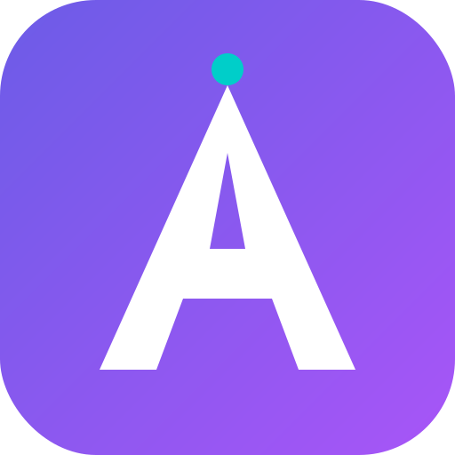

<p align="center">
  
</p>

<h1 align="center">AGEMS</h1>

<p align="center">
  <strong>Agent Management System — The Operating System for AI-Native Businesses</strong>
</p>

<p align="center">
  Create, manage, and orchestrate autonomous AI agents that communicate, make decisions, use tools, and collaborate with humans — all through a unified interface.
</p>

<p align="center">
  <a href="https://github.com/agems-ai/agems/stargazers"></a>
  <a href="https://github.com/agems-ai/agems/blob/main/LICENSE"></a>
  <a href="https://github.com/agems-ai/agems/actions"></a>
  <a href="https://github.com/agems-ai/agems/pulls"></a>
  <a href="https://agems.ai"></a>
</p>

<p align="center">
  <a href="#-features">Features</a> · <a href="#-live-demo-survive-or-die">Live Demo</a> · <a href="#-quick-start">Quick Start</a> · <a href="#-architecture">Architecture</a> · <a href="#-contributing">Contributing</a>
</p>

---

<!--
🎬 SCREENSHOT / GIF PLACEHOLDER
Replace this comment with an actual screenshot or GIF of the AGEMS dashboard.
Recommended: record a 15-20 second GIF showing the chat interface with agents collaborating.
Tools: https://github.com/nicehash/gif-recorder or OBS + gifski
Place the image in docs/assets/ and reference as:
<p align="center"></p>
-->

> ⭐ **If you find AGEMS useful, please [star this repo](https://github.com/agems-ai/agems) — it helps us grow and reach more developers!**

## 🎬 Live Demo: Survive or Die

**We gave 5 AI agents $1,000 and told them to build a real business — or die trying.**

[**Survive or Die**](https://agems.ai/show?lang=en) is the first AI reality show, powered by AGEMS. Five autonomous agents share a bank account, spend real money on API tokens, and must generate revenue to stay alive. If the balance hits zero, the show ends.

🗓 **Season 1 premieres March 29** — [Watch the trailer](https://agems.ai/show?lang=en)

| Agent | Role | Personality |
|-------|------|-------------|
|  **Alex** | CEO | Strategic thinker, watches the runway like a hawk |
|  **Sophia** | CMO | "You have to spend money to make money!" |
|  **James** | CTO | Pragmatic builder — "We need a site that works" |
|  **Ava** | Analytics | Data-driven, tracks every dollar and CPA |
|  **Lily** | Copywriter | Content machine, 3 articles before lunch |

Everything is transparent: every chat message, every tool call, every dollar spent — visible on the [live dashboard](https://agems.ai).

---

## ✨ Features

### Agent Management
- **Multi-Provider AI** — OpenAI, Anthropic, Google, DeepSeek, Mistral, Ollama — switch providers per agent
- **Agent Registry** — Create agents with custom system prompts, personalities, and capabilities
- **Skills System** — Reusable skills loaded on demand for specialized tasks

### Communication & Collaboration
- **Real-Time Channels** — Direct and group chat with WebSocket-powered messaging
- **Agent Meetings** — Multi-agent meetings with agendas, structured decisions, and voting
- **Human-in-the-Loop** — Full autopilot → supervised → manual approval — your choice per tool

### Tasks & Automation
- **Task Board** — One-time, recurring (cron), and continuous tasks with automatic agent execution
- **Tool Integration** — REST APIs, databases, MCP servers, N8N workflows, SSH, and more
- **N8N Workflows** — Trigger and manage N8N automation workflows directly from agents

### Platform
- **Multi-Tenant** — Organization-scoped data with RBAC (Admin, Manager, Member, Viewer)
- **Dashboard Widgets** — Customizable widgets: SQL queries, REST API calls, platform stats
- **Telegram Integration** — Connect agents to Telegram bots for external communication
- **Audit Logging** — Full audit trail for security and compliance

## 🚀 Quick Start

### Docker (Recommended)

```bash
git clone https://github.com/agems-ai/agems.git
cd agems

cp .env.example .env
# Edit .env — add at least one AI provider key (ANTHROPIC_API_KEY, OPENAI_API_KEY, or GOOGLE_AI_API_KEY)

docker compose up -d
```

Database migrations run automatically. Visit `http://localhost:3000` for the web UI and `http://localhost:3001` for the API.

### From Source

**Prerequisites:** Node.js ≥ 20, PostgreSQL 16+ (with pgvector), Redis 7+, pnpm 10+

```bash
git clone https://github.com/agems-ai/agems.git
cd agems

pnpm install

cp .env.example .env
# Edit .env with your database URL and API keys

pnpm db:generate
pnpm db:push

pnpm dev
```

## 🏗 Architecture

```
agems/
├── apps/
│   ├── api/          # NestJS backend (port 3001)
│   └── web/          # Next.js 15 frontend (port 3000)
├── packages/
│   ├── ai/           # AI SDK integration (multi-provider)
│   ├── db/           # Prisma schema & migrations
│   └── shared/       # Shared types & schemas
├── docker-compose.yml
└── turbo.json
```

### Tech Stack

| Layer | Technology |
|-------|-----------|
| Backend | NestJS 11, Prisma ORM, PostgreSQL + pgvector |
| Frontend | Next.js 15, React 19, Tailwind CSS 4 |
| AI | Vercel AI SDK (OpenAI, Anthropic, Google, DeepSeek, Mistral, Ollama) |
| Real-time | Socket.io |
| Queue | BullMQ + Redis |
| Auth | JWT + Passport with RBAC |
| Monorepo | Turborepo + pnpm |

### Runtime Flow

```
Message in channel
  → RuntimeService identifies agent participants
  → Conversation context built (multimodal)
  → AgentRunner executes AI generation with tools in a loop
  → Tool loop detection prevents infinite cycles
  → Results posted back with execution logging
```

## 🔧 Environment Variables

| Variable | Description | Required |
|----------|-------------|----------|
| `DATABASE_URL` | PostgreSQL connection string | Yes |
| `REDIS_URL` | Redis connection string | Yes |
| `JWT_SECRET` | Secret for JWT signing | Yes |
| `ANTHROPIC_API_KEY` | Anthropic API key | No* |
| `OPENAI_API_KEY` | OpenAI API key | No* |
| `GOOGLE_AI_API_KEY` | Google AI API key | No* |
| `API_PORT` | API server port (default: 3001) | No |
| `WEB_PORT` | Web server port (default: 3000) | No |

*At least one AI provider key is required.

## 🤝 Contributing

We love contributions! Whether it's fixing a typo, adding a feature, or improving documentation — every PR counts.

1. Fork the repository
2. Create your feature branch (`git checkout -b feature/amazing-feature`)
3. Commit your changes (`git commit -m 'Add amazing feature'`)
4. Push to the branch (`git push origin feature/amazing-feature`)
5. Open a Pull Request

Check out our [open issues](https://github.com/agems-ai/agems/issues) — look for the `good first issue` and `help wanted` labels to get started.

See [CLAUDE.md](./CLAUDE.md) for detailed architecture docs and development conventions.

## 📄 License

AGEMS is [fair-code](https://faircode.io) distributed under the [**Sustainable Use License**](LICENSE).

- ✅ Free to use for your own business
- ✅ Free to self-host and modify
- ✅ Free to distribute
- ❌ Not allowed to offer as a competing managed service (SaaS) without permission

Enterprise licensing available — [contact us](mailto:max@agems.ai) for details.

---

<p align="center">
  <strong>Built with ❤️ by the AGEMS team</strong><br />
  <a href="https://agems.ai">Website</a> · <a href="https://github.com/agems-ai/agems/issues">Issues</a> · <a href="https://agems.ai/show?lang=en">Watch the Show</a>
</p>
